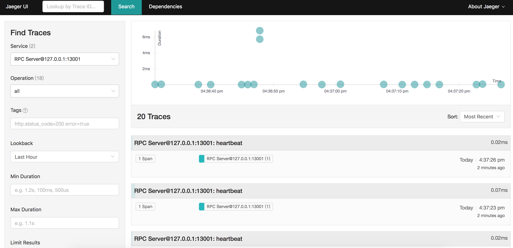
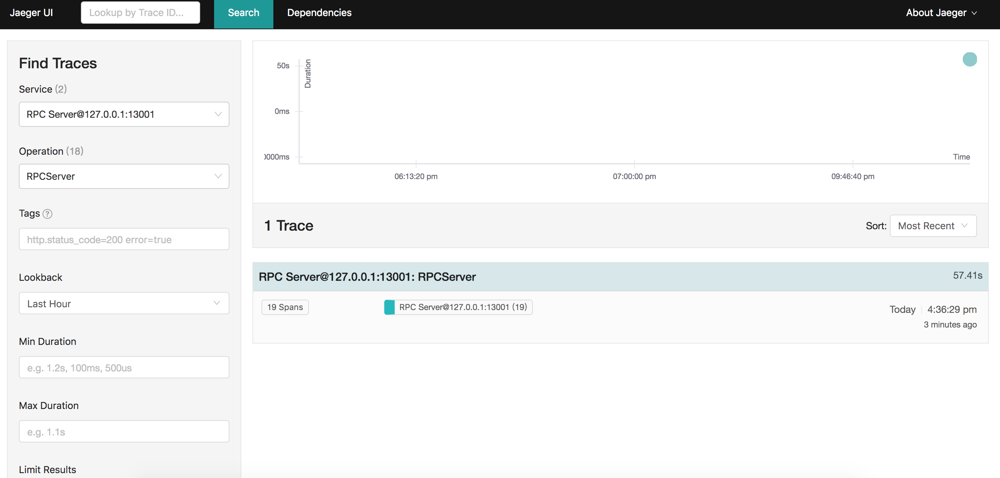
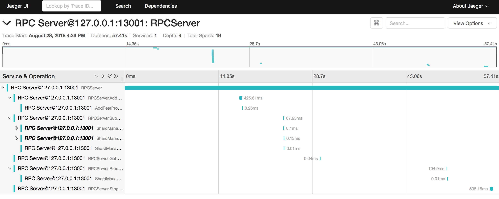
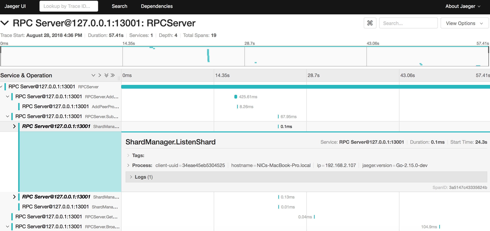

### Setting up the tracer
> #### All in one Docker image
> This image, designed for quick local testing, launches the Jaeger UI, collector, query, and agent, with an in memory storage component.
> You can then navigate to http://localhost:16686 to access the Jaeger UI.

```
$ docker run -d --name jaeger -p 6831:6831/udp -p 6832:6832/udp -p 5778:5778 -p 16686:16686 -p 14268:14268 jaegertracing/all-in-one:latest
```

### snapshots of the tracer UI

#### Search by service

service name, e.g., `RPCServer@x.x.x.x:y`



#### Search by operation

operation name e.g. `RPCServer`, `RPCServer.AddPeer`, `RPCServer.BroadcastCollation`, etc.



#### Overview of one trace



#### Overview of one span

Click on certain span to expand and get an overview of the span



#### Detail of one span

Click on the info, e.g., `Tags`, `Process`, `Logs`, to expand and get more detail regarding the span


